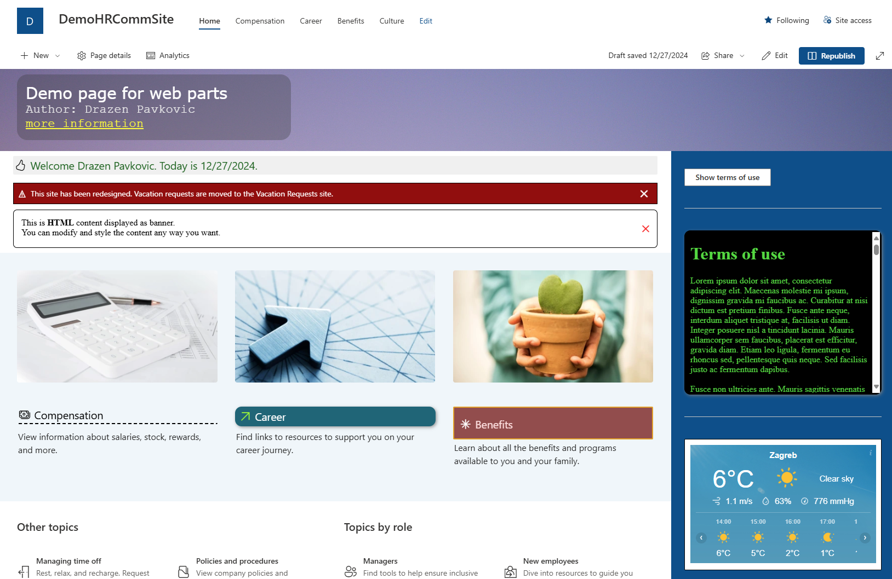

# InfoSovaWebPartPack

InfoSova Web Part pack contains several SPFx web parts that can help you in designing your SharePoint Online pages. 
This package is distributed with MIT license which means, in short, you can freely use these web parts, but no warranty of any kind is provided.
Check [LICENSE](LICENSE) for more information.

General technical information is available [HERE](gitHubAssets/README-TECHNICAL.md).

## How to get this web part package

To use this package you can download the [SPPKG file](sharepoint/solution/InfoSovaWPPack.sppkg). 
You can also build the package yourself, since the entire source code is available here.
In that case, you probably know how to work with SPFx solutions, but here are some links with some info:
- [Set up your SharePoint Framework development environment](https://learn.microsoft.com/en-us/sharepoint/dev/spfx/set-up-your-development-environment)
- Remember to execute `npm install` after downloading the solution to get all the required npm packages

## Web parts included in the package

The following web parts are included in the solution:
- **Heading** - this web part can be used to create headers for your columns with data ([READ MORE](gitHubAssets/README-HEADING.md))
- **Page header** - this web part provides alternative way to create custom page header ([READ MORE](gitHubAssets/README-PAGEHEADER.md))
- **Popup** - this web part is used to display a popup on a page. Popup can be activated on button click or automatically ([READ MORE](gitHubAssets/README-POPUP.md))
- **Content** - this web part can be used for many different things. It can be used to display greetings, alerts, HTML content and even provide you with interesting design solutions ([READ MORE](gitHubAssets/README-CONTENT.md))

The following image illustrates the usage of available web parts on a page.
The page below is not the prettiest out there (actually a total visual mess), but you can see the most common scenarios in which these web parts can be used.

Top:
- **Page header web part** that can use color background or image, and displays custom HTML content.

Left column:
- **Content web part** that serves as a **greeting web part**.
- **Content web part** that serves as a **closable alert**.
- **Content web part** that serves as a **closable alert** with custom HTML content.
- Three content columns that use **Heading web part** (Compensation, Career, Benefits).

Right column:
- "Show terms of use" button that opens a **popup** on user's click action.
- **Content web part** that displays custom HTML.
- **Content web part** that encapsulates content provided by an external service.

