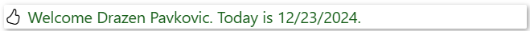
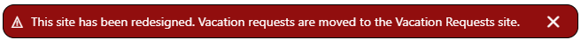
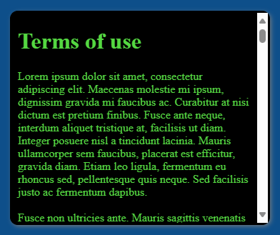
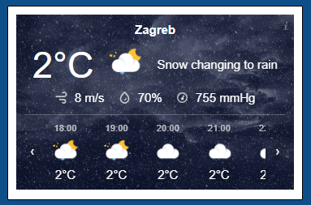

# InfoSovaWebPartPack - Content web part

Content web part is the most complex in the package.

**For typical users** it provides the ability to display standard elements like greetings, banners and alerts.

**For advanced users**, people with HTML and CSS experience can embed custom HTML content on the page. They can embed external HTML content (so-called widgets) provided by external services (stock quotes, weather information, exchange rates...). 
> [!CAUTION]
> When you turn on a checkbox **"Shrink web part?"** this web part modifies HTML on the page outside of the web part's context to deal with "margin collapse" and provide better look and feel.

## Some of the use cases for this web part

**For a typical user** 
Basic greeting web part that can display current user's display name and current date. 

**For a typical user** 
Basic alert web part. Notice the 'X', which means that this element is closable. When user closes the element, this action can be remembered, and on the next page load, the alert is not displayed. 

**For an ADVANCED user** 
Embedding HTML content on the page. HTML content with styles can be directly entered as a parameter of the web part, or the HTML file can be displayed. 

**For an ADVANCED user** 
You can embed content from other online sites (with limitations). 

## Web part customization

The key elements of configuration are:
- content and design
- manipulate elements margins
- make element closable by displaying 'X' icon button and remember user actions

You can configure the following elements for this web part:
- content
  - Plain text (you can use %%USERNAME%% and %%CURRENTDATE%% with this type of content)
  - HTML
  - HTML from an HTML file
- icon (only usable with Plain text mode - if you use HTML content, you can style it in any way you want)
- styles like font size, foreground and background color, border width, radius and color, drop shadow
- dimensions (width in pixels or percentage, height in pixels, content padding)
- **(ADVANCED)** margins (top margin, left margin, bottom margin, z-index, shrink web part)
  - negative margins can place the element over some other elements on the page
  - z-index should be 0 in most cases, but can be set if needed
  - **Shrink web part** will modify next element's top margin to deal with a problem of spacing, when negative margins are used
- show 'X' to make this element closable
  - optionally, remember user actions
