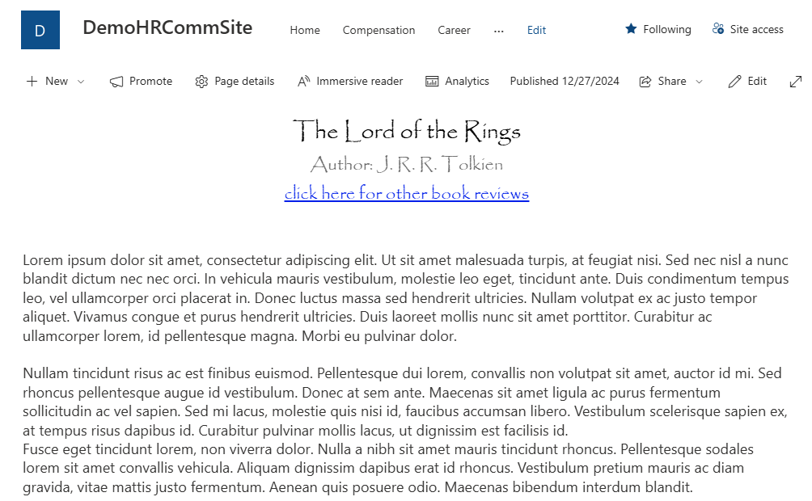
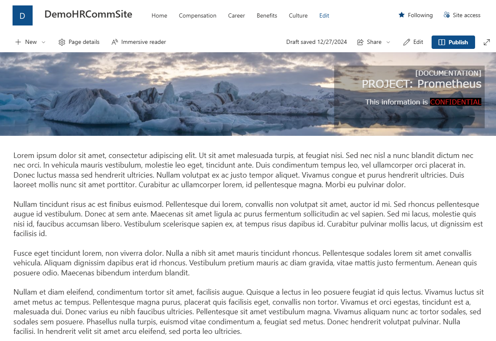

# InfoSovaWebPartPack - Page header web part

Page header web part allows you to customize your title are on the page. 
You can use image as background or plain color background. 
You can style the overlay and position it on the left, in the center or on the right side of the page. 
Web part mimics the behavior of standard banner web part, so the overlay follows the content of the page.

Below you can see two pages that use InfoSova Page header web part.

<table>
<tr><td style="padding:10px;border:none;">

</td>
<td style="padding:10px;border:none;">

</td>
</tr>
</table>

The key elements of configuration are:
- content for page header (HTML displayed in IFRAME)
- overlay position (left, center, right)
- ability to pick image or the background color
- dimensions for image(container) and overlay, with padding
- overlay style
