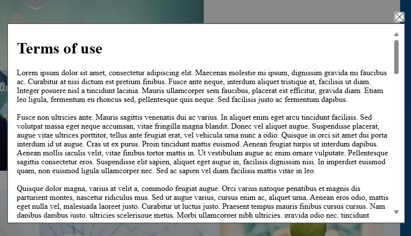
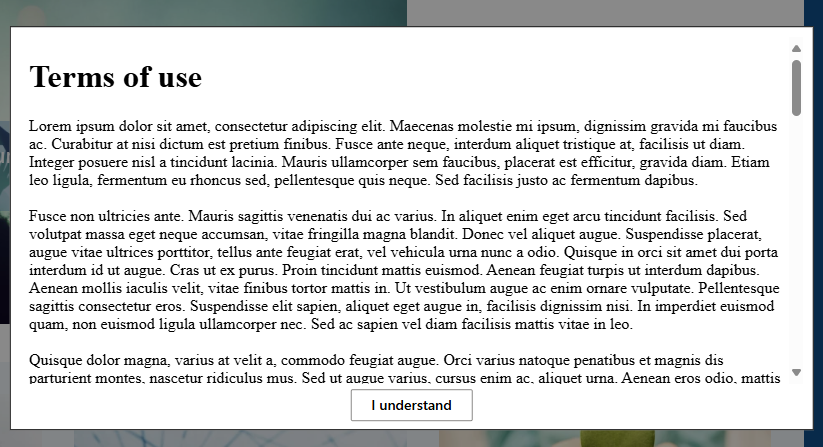

# InfoSovaWebPartPack - Popup web part

Popup web part allows you to add a popup element on your SharePoint Online page. For example, you can display Terms and conditions in a popup on user click.

You can also automatically display a popup. For example, you can inform a user that this page is obsolete and redirect them to another page.

A basic popup: 

A popup that has a button (note that if button is present, the 'X' element is not displayed): 

The key elements of configuration are:
- content, position and dimesions
- **auto-display of popup**
- **redirect to another page on popup close**
- **remember user action**

You can configure the following elements for this web part:
- Popup content (HTML text or a link to an HTML file)
- Caption for the Close button
  - If this value is empty, an "X" in the top right corner will be available to the user. This is the default way to display pop.
  - Additional context can be provided to the user reading the information in the popup. For example, on the "Terms and Conditions" popup, you can set the value of this parameter to "I understand". A button with that label will be displayed instead of a standard 'X'.
- You can auto-show the popup after specified number of seconds after a page is load
  - Typically, you will allow users a second or two to see the page content, before showing the automatic popup
  - When you decide to automatically display the popup, the open popup button is not displayed
- Set the text for the open popup button
- Define the position of the popup (left, center, right - top, center, bottom)
- Dimensions of the popup in percentage or in pixels
- Redirect a user to the specified URL on popup close
- Remember user's close action
  - Typically used with auto-display
  - You can configure the web part to display the popup to a user just a specific number of times. Closing the popup can be considered as an acknowledgment of the information provided in the popup, and additional displays of popup are not needed.
